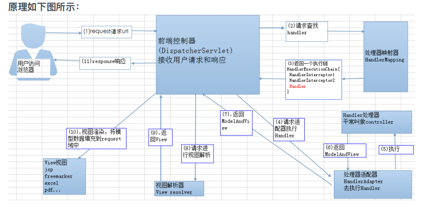

# JavaStudy
Java知识学习 
第一天 单例模式，对象唯一，必须自己创造自己的对象；构造方法私有；给所有对象提供  
1、饿汉式：类加载时及创建对象，不管需要不需要  
1.1、直接new静态对象  
1.2、枚举类型，可以将对象限定在有限的几个里，可以设置成唯一一个，即为单例模式，直接定义名称即可。  
1.3、通过静态代码块实例化对象，可以处理一下数据逻辑。  
2、懒汉式：调用是才会创建对象  
2.1、线程不安全：写在静态方法里，外部调用该方法，才去实例化对象，但是如果是多线程，并且没有做锁处理，就会出现多个对象，导致线程不安全。  
2.2、线程安全：需要在获取实例化对象前，对类或者方法进行加锁处理。  
2.3 匿名内部类，由于只在调取类的时候才会加载其中的静态变量，所以调用匿名内部类时才会创建对象，并且jvm对匿名内部类做了线程安全处理。  

第二天 类初始化和实例初始化  
一、类初始化过程 父类静态变量->父类静态代码块->子类静态变量->子类静态代码块->构造代码块->构造函数->  
1、一个类要创建创建实例需要先加载并初始化该类  
    main方法所在的类要先初始化  
2、子类初始化需要先初始化父类  
3、一个类的初始化就是执行<clinit>()方法，由虚拟机来生成  
   <clinit>方法由静态类变量显示赋值代码和静态代码块组成，执行顺序是从上到下  
   <clinit>只执行一次  
二、实例初始化就是执行<init>()方法，也是由jvm生成，有几个构造方法就有几个该方法  
1、<init>()方法由非静态实例变量显示赋值代码和非静态代码块代码、对应构造器代码组成  
2、非静态实例变量显示赋值代码和非静态代码块代码从上到下执行，对应构造器代码组成最后执行  
3、每次创建实例对象，调用对应的构造器，执行的就是对应的<init>方法  
4、<init>方法的首行是super()或super(实参)，即对应父类<init>方法  

三、方法的重写  
非静态方法前面其实有一个默认的对象this  
this在构造器里表示的是正在创建的对象，所以如果创建的是子类，就会执行子类重写的方法。而不会执行父类对应的方法  
final方法、静态方法 、private 等在子类中不可见的方法不可以被重写。  

第三天 参数传递、递归与迭代、成员变量和局部变量  
1、基础数据类型、包装类的不可变性，不会根据方法内的变动改变参数，对象、数组传递的是地址，因此修改的对象就是传递进去的对象，会根据方法内改变。  
2、递归：代码简洁、易读，但是空间消耗严重   
   迭代，代码易读，  
3、成员变量包括全局变量和实例变量 全局变量是在类加载时载入，全局唯一，修改会作用全局，实例变量是只在当前实例生效，局部变量则只在局部生效，比如方法中的变量，方法调用结束就释放掉了，不会影响成员变量。  

第四天 Spring
一、Sring Bean的作用域
可以通过scope属性设置bean的作用域，已决定该bean是单实例还是多实例  
1、singleton 单例，在SpringIOC容器中只有一个Bean实例，默认作用域  
2、prototype 每次调用getBean都会生成一个新的实例  
3、request 每个http请求都会生成一个实例，该请求共享该实例，仅适用于WebApplicationContext环境  
4、session 每个session会话都会生成一个实例，该会话共享该实例，仅适用于WebApplicationContext环境  

二、Spring支持的常用数据库事务传播属性和事务隔离级别
当事务方法被另一个事务方法调用时，该方法是使用调用方法的事务还是开启新的事务
Spring定义了7种传播行为
1、required 如果有事务在运行，就使用该事务
2、required_new 如果有事务在运行，挂起该事务，启动新事务，在自己的事务内运行
3、support 如果有事务在运行，当前方法在该事务内运行，否则可以不运行在事务内
4、not_support 当前方法不应该运行在事务内，如果有运行的事务，挂起
5、mandatory 当前方法必须运行在事务内，如果没有正在运行的事务，抛出异常
6、never 当前的方法不应该在运行在事务内，如果有运行的事务，抛出异常
7、nested 如果有事务在运行，当前方法应该在当前事务的嵌套事务运行，否则新建一个事务，并在自己的事务内运行
使用：在需要添加事务的方法上加上注释 @Transactional(propagation = Propagation.REQUIRES_NEW)即可，假如使用的是requires_new,则每次调用该方法都会建立一个事务，调用完成后事务提交  

三、Spring Mvc的工作流程
1、客户端发送请求到中央控制器（DispatcherServlet）  
2、中央控制器(DispatcherServlet)根据请求信息调⽤处理器映射器(HandlerMapping) ，解析请求对应的 Handler 。  
3、解析到对应的 Handler （也就是我们平常说的 Controller 控制器）后，开始由 HandlerAdapter 适配器处理。
4、HandlerAdapter 会根据 Handler 来调⽤真正的处理器开处理请求，并处理相应的业务逻辑。
5、处理器处理完业务后，会返回⼀个 ModelAndView 对象， Model 是返回的数据对象， View 是个逻辑上的 View 。
6、ViewResolver 会根据逻辑 View 查找实际的 View 。
7、DispaterServlet 把返回的 Model 传给 View （视图渲染）。
8、把 View 返回给请求者（浏览器）

总结：中央控制器（DispatcherServlet）主要做了
1、客户端发送的请求接受；  
2、根据发送来的请求去处理器映射器（handlemapping）拿到对应的handleExceptionChain,包含处理器拦截器和处理器对象;  
3、拿到handleExceptionChain之后去找到处理器适配器（handleAdapter）调用（handle），调用完之后返回ModelAndView;
4、调用视图解析器（viewResolver）返回view
5、渲染视图，将模型数据填充至request域；返回给客户端。

四、Mybatis实体类和数据库字段不一致  
1、查询时取别名  
2、在全局配置中开启驼峰命名规则，会把下划线变成驼峰命名  
3、在Mapper映射文件中使用resultMap自定义映射规则。即把每个字段和数据库中字段一一对应。  

五、linux常用命令
service 服务名 start
